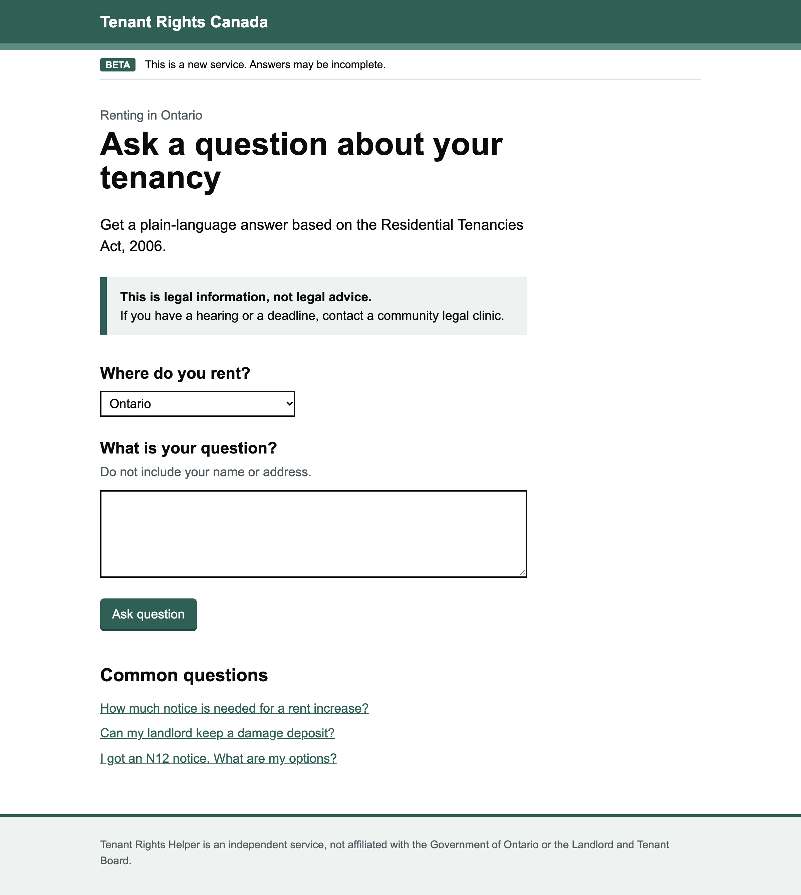
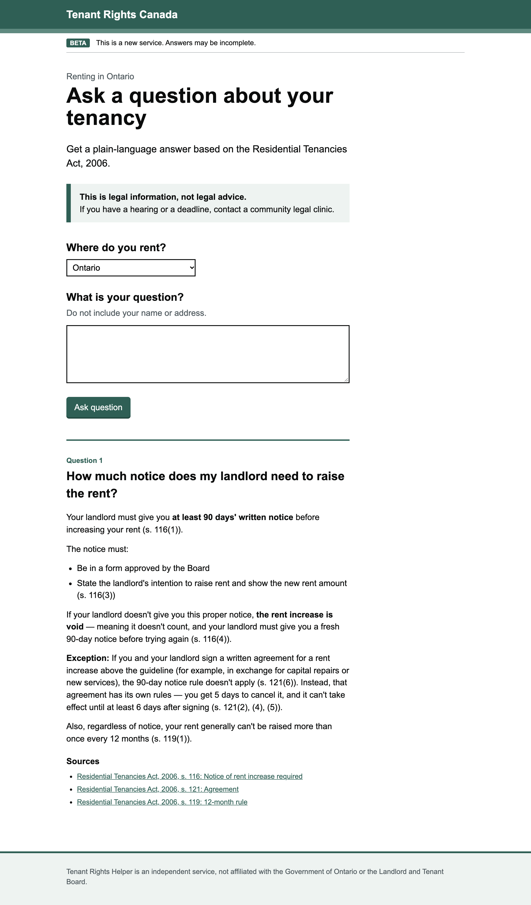

# Tenant Rights Canada

A small web frontend for asking questions about renting in Canada. Answers are written in plain
language, based on the Residential Tenancies Act, 2006 (Ontario), and stream in as they are
generated, with links to the sections they cite.

> This is legal information, not legal advice.





## How it works

The page is plain HTML, CSS and JavaScript with no build step. `app.js` is split into three classes:

- `ApiClient` talks to the backend: `GET /api/jurisdictions` and the streaming `POST /api/chat`
- `Markdown` renders the answer's paragraphs, lists and bold text
- `ChatApp` handles the form, the jurisdiction picker and showing answers and sources

`/api/chat` takes `{ "question": "...", "jurisdiction": "ON" }` and replies with server-sent
events: `token` for each piece of the answer, `citations` for the sections used, then `done`.

## Running locally

1. Start the backend on `http://localhost:8080`.
2. Serve this folder:

   ```sh
   python3 -m http.server 5173
   ```

3. Open http://localhost:5173.

The backend URL is set at the bottom of `app.js`.
